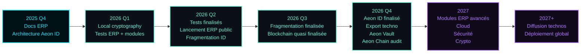

```mermaid
flowchart LR
    classDef aeon2025 fill:#001015,stroke:#00eaff,stroke-width:2px,color:#00eaff;
    classDef aeon2026 fill:#0a0f18,stroke:#5ef0d4,stroke-width:2px,color:#5ef0d4;
    classDef aeon2027 fill:#10091a,stroke:#b072ff,stroke-width:2px,color:#b072ff;

    A2025["2025 Q4<br>Docs ERP<br>Architecture Aeon ID"]:::aeon2025
    A2026Q1["2026 Q1<br>Local cryptography<br>Tests ERP + modules"]:::aeon2026
    A2026Q2["2026 Q2<br>Tests finalisés<br>Lancement ERP public<br>Fragmentation ID"]:::aeon2026
    A2026Q3["2026 Q3<br>Fragmentation finalisée<br>Blockchain quasi finalisée"]:::aeon2026
    A2026Q4["2026 Q4<br>Aeon ID finalisé<br>Export techno<br>Aeon Vault<br>Aeon Chain audit"]:::aeon2026
    A2027["2027<br>Modules ERP avancés<br>Cloud<br>Sécurité<br>Crypto"]:::aeon2027
    A2027PLUS["2027+<br>Diffusion technos<br>Déploiement global"]:::aeon2027

    A2025 --> A2026Q1 --> A2026Q2 --> A2026Q3 --> A2026Q4 --> A2027 --> A2027PLUS
```

