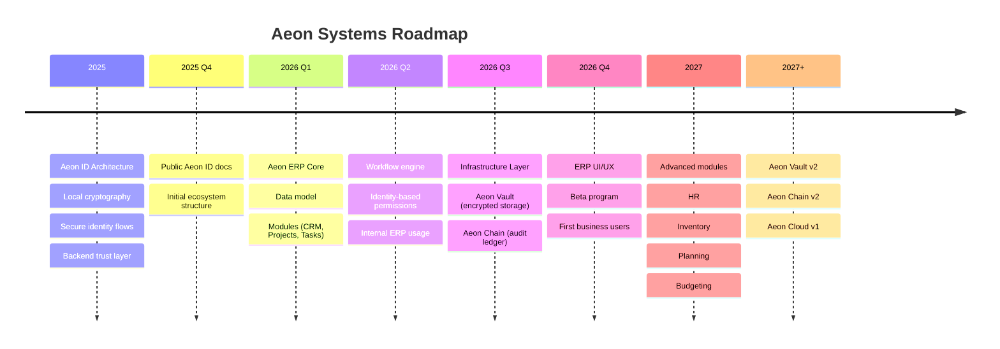

```mermaid
timeline
    title Aeon Systems Roadmap

    2025 : Aeon ID Architecture : Local cryptography : Secure identity flows : Backend trust layer
    2025 Q4 : Public Aeon ID docs : Initial ecosystem structure

    2026 Q1 : Aeon ERP Core : Data model : Modules (CRM, Projects, Tasks)
    2026 Q2 : Workflow engine : Identity-based permissions : Internal ERP usage

    2026 Q3 : Infrastructure Layer : Aeon Vault (encrypted storage) : Aeon Chain (audit ledger)
    2026 Q4 : ERP UI/UX : Beta program : First business users

    2027 : Advanced modules : HR : Inventory : Planning : Budgeting
    2027+ : Aeon Vault v2 : Aeon Chain v2 : Aeon Cloud v1
```

