```mermaid
flowchart TD
    classDef year fill:#05080b,stroke:#00f6ff,stroke-width:2px,color:#00f6ff;
    classDef phase fill:#070b10,stroke:#444,stroke-width:1.5px,color:#ffffff;
    classDef item fill:#0c1117,stroke:#333,stroke-width:1px,color:#d0d0d0;

    Y2025["2025 - Identity layer"]:::year
    P1["Phase 1 - Aeon ID"]:::phase
    P1A["Define identity model"]:::item
    P1B["Local crypto engine"]:::item
    P1C["Secure flows"]:::item
    P1D["Backend trust layer"]:::item
    P1E["Public docs and aeon-id repo"]:::item

    Y2025 --> P1 --> P1A --> P1B --> P1C --> P1D --> P1E

    Y2026["2026 - ERP foundation"]:::year
    P2["Phase 2 - Aeon ERP core"]:::phase
    P2A["Core data model"]:::item
    P2B["Core modules"]:::item
    P2C["Workflow engine"]:::item
    P2D["Identity integration"]:::item
    P2E["Internal ERP in use"]:::item

    P1E --> Y2026 --> P2 --> P2A --> P2B --> P2C --> P2D --> P2E

    YINFRA["2026 - Infra layer"]:::year
    P3["Phase 3 - Internal infrastructure"]:::phase
    P3A["Aeon Vault base"]:::item
    P3B["Aeon Chain base"]:::item
    P3C["Cloud planning"]:::item

    P2E --> YINFRA --> P3 --> P3A --> P3B --> P3C

    YLAUNCH["2026 Q3-Q4 - Launch"]:::year
    P4["Phase 4 - Commercial ERP"]:::phase
    P4A["ERP UI and UX"]:::item
    P4B["Beta program"]:::item
    P4C["Docs and onboarding"]:::item
    P4D["First paying customers"]:::item

    P3C --> YLAUNCH --> P4 --> P4A --> P4B --> P4C --> P4D
```

    YEXP["2027+ - Expansion"]:::year
    P5["Phase 5 - Expansion and scale"]:::phase
    P5A["Advanced ERP modules"]:::item
    P5B["Aeon Vault v2"]:::item
    P5C["Aeon Chain v2"]:::item
    P5D["Aeon Cloud v1"]:::item

    P4D --> YEXP --> P5 --> P5A --> P5B --> P5C --> P5D
