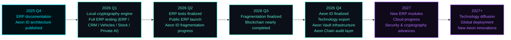

```mermaid
flowchart LR
    %% COLORS
    classDef aeon2025 fill:#001015,stroke:#00eaff,stroke-width:2px,color:#00eaff;
    classDef aeon2026 fill:#0a0f18,stroke:#5ef0d4,stroke-width:2px,color:#5ef0d4;
    classDef aeon2027 fill:#10091a,stroke:#b072ff,stroke-width:2px,color:#b072ff;

    %% NODES
    A2025["2025 Q4<br>ERP documentation<br>Aeon ID architecture published"]:::aeon2025

    A2026Q1["2026 Q1<br>Local cryptography engine<br>Full ERP testing (ERP / CRM / Vehicles / Stock / Private AI)"]:::aeon2026

    A2026Q2["2026 Q2<br>ERP tests finalized<br>Public ERP launch<br>Aeon ID fragmentation progress"]:::aeon2026

    A2026Q3["2026 Q3<br>Fragmentation finalized<br>Blockchain nearly completed"]:::aeon2026

    A2026Q4["2026 Q4<br>Aeon ID finalized<br>Technology export<br>Aeon Vault infrastructure<br>Aeon Chain audit layer"]:::aeon2026

    A2027["2027<br>New ERP modules<br>Cloud progress<br>Security & cryptography advances"]:::aeon2027

    A2027PLUS["2027+<br>Technology diffusion<br>Global deployment<br>New Aeon innovations"]:::aeon2027

    %% FLOW
    A2025 --> A2026Q1 --> A2026Q2 --> A2026Q3 --> A2026Q4 --> A2027 --> A2027PLUS
```

