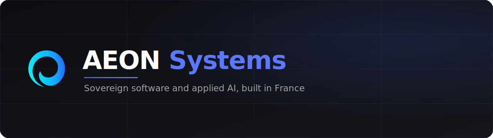

<picture>
  <source media="(prefers-color-scheme: dark)" srcset="assets/hero-dark.svg">
  <source media="(prefers-color-scheme: light)" srcset="assets/hero-light.svg">
  
</picture>

  

---

AEON Systems conçoit les logiciels et les systèmes d'intelligence artificielle sur lesquels les entreprises s'appuient. Chaque capacité est un service indépendant, avec ses propres données et sa propre enveloppe de mise à l'échelle, assemblés en une plateforme unique. Conçu et hébergé en France.

## Ce que nous construisons

| Domaine | Périmètre |
| :-- | :-- |
| **Identité et signature** | Signature électronique, onboarding, vérification d'identité |
| **Conformité** | Facturation, archivage à valeur probante, automatisation réglementaire |
| **IA appliquée** | Compréhension documentaire, recherche sémantique, agents, modèles du monde |
| **Cybersécurité et supervision** | Contrôles continus, télémétrie, surveillance à l'exécution |
| **Infrastructure** | Le socle partagé qui relie l'ensemble des services |

## StrucTime

[**StrucTime**](https://structime.app) est notre plateforme de terrain pour les PME françaises, avec la conformité légale intégrée dans chaque module opérationnel. Elle repose sur les mêmes services modulaires, avec une couche d'IA sur tout le produit. StrucTime est la marque déposée d'AEON Systems.

## Recherche

AEON Research développe des systèmes d'IA souverains. [**StrucTime LWM**](https://github.com/Aeon-HQ/structime-lwm) est un Large World Model pour systèmes dynamiques, entraîné et évalué sur données réelles.

## Ingénierie

- **Modulaire par défaut.** Chaque capacité est un service indépendant, avec ses données et son cycle de vie.
- **IA native.** Modèles, recherche sémantique et agents font partie de l'architecture.
- **Conformité par le code.** La réglementation française et européenne est encodée dans la plateforme.
- **Typé de bout en bout.** Des clients typés générés maintiennent les services alignés.
- **Pensé pour le terrain.** Vitesse et clarté pour celles et ceux qui opèrent l'entreprise.

[aeon-systems.fr](https://aeon-systems.fr) &nbsp;·&nbsp; contact@aeon-systems.fr &nbsp;·&nbsp; France

